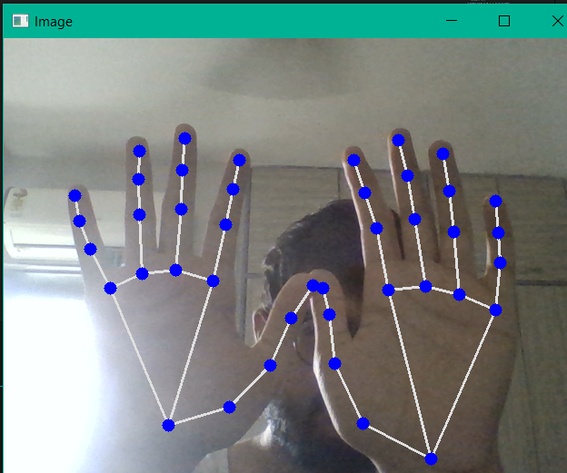

# Virtual_Keyboard
 "Virtual Hand Gesture Keyboard" is a project that utilizes hand recognition technique to create a virtual keyboard. By detecting and interpreting hand gestures, the system allows users to type characters, symbols, and perform actions without physical interaction. This innovative solution provides an intuitive and contactless alternative to traditional keyboards, enhancing accessibility and convenience in a variety of applications.

## Dependencies

This project requires the following dependencies:

- OpenCV (cv2): A computer vision library used for capturing and processing video frames. Install using `pip install opencv-python`.

- pyautogui: A cross-platform library for GUI automation and keyboard/mouse control. Install using `pip install pyautogui`.

- mediapipe: A framework for building multimodal machine learning pipelines. It is used here for hand tracking. Install using `pip install mediapipe`.

 ## keyboard_module

This Python script utilizes the OpenCV and Mediapipe libraries to create a hand gesture recognition keyboard. The `handDetector` class implements hand tracking, finger detection, and distance measurement between hand landmarks. By performing specific hand gestures, users can interact with the virtual keyboard. The script captures video frames from the default camera, processes them using the `handDetector` class, and displays the live feed with FPS (frames per second) information.

## Customizable Keyboard(main.py)

Run `main.py` to initialize the camera for recognition. The keyboard design revolves around using thumbs as trigger points or switches, providing up to 32 unique combinations. Users have the flexibility to assign these combinations to any desired elements of a keyboard, enabling personalized and intuitive interactions. The script captures video frames from the default camera, tracks hand movements, and maps the detected gestures to corresponding key presses using the `pyautogui` library. 

## Future Aspects

This virtual gesture-based keyboard project has exciting potential for future development and expansion. Here are some possible directions for future enhancements:

- **Integration with Any Camera**: The project can be further extended to integrate with various camera devices, allowing users to utilize the virtual keyboard with their preferred cameras and setups.

- **Remote Typing and Control**: By leveraging internet connectivity, the system can be enhanced to provide remote typing capabilities. Users could remotely input text on connected devices, enabling convenient control and accessibility.

- **Expanded Gesture Vocabulary**: The project's gesture recognition capabilities can be expanded by incorporating additional hand gestures or incorporating more complex gestures for a wider range of keyboard functionalities and interactions.

- **Gesture Customization**: Providing a user-friendly interface or configuration file for gesture customization would allow users to define their own gesture-key mappings, tailoring the virtual keyboard to their specific needs and preferences.

These future aspects present exciting opportunities for further exploration and development of the virtual gesture-based keyboard, enhancing its functionality, versatility, and usability in various contexts.

